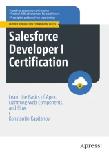

# Apress Source Code

This repository accompanies [Salesforce Developer I Certification: Learn the Basics of Apex, Lightning Web Components, and Flow](https://www.link.springer.com/book/10.1007/9798868802997) by Konstantin Kapitanov (SpringerNature, 2024).

Download the files as a zip using the green button, or clone the repository to your machine using Git.

## Releases

Release v1.0 corresponds to the code in the published book, without corrections or updates.

## Contributions

See the file Contributing.md for more information on how you can contribute to this repository.